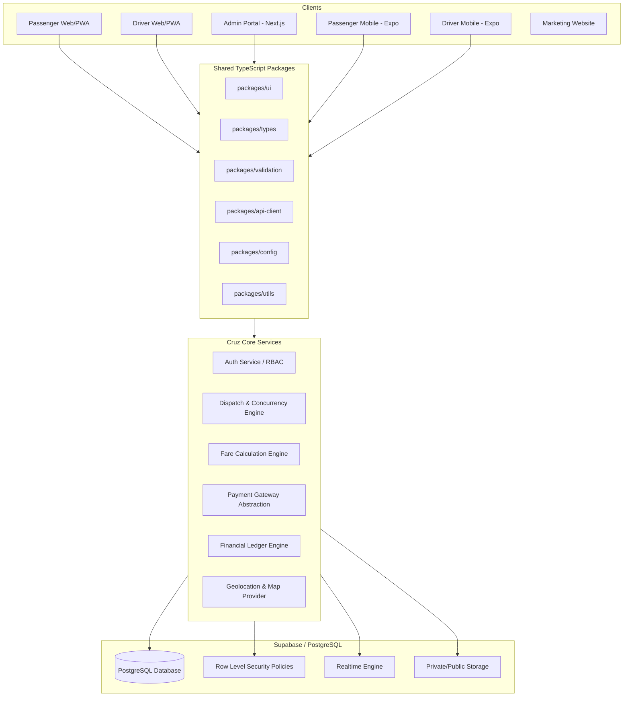

# Cruz — System Architecture Overview

## 1. High-Level Architecture

The Cruz platform uses a decoupled, modular architecture centered on a common PostgreSQL database managed by Supabase, unified TypeScript types, and dedicated frontend clients.

## 2. Core Architectural Principles
1. **Separation of Presentation & Business Logic**: All business rules (fares, dispatch eligibility, state machine transitions, financial transactions) live server-side in deterministic services or PostgreSQL functions/triggers.
2. **Provider Abstractions**: External dependencies (Payments, Maps, Push Notifications, SMS) are wrapped in abstract TypeScript interfaces. During development, zero-cost Mock providers are used. Production services (Google Maps, M-Pesa Daraja, FCM) implement the exact same interfaces.
3. **Concurrency-Safe Dispatch**: Concurrency locks on database records ensure a trip can only ever be accepted by a single driver, preventing race conditions.
4. **Append-Only Immutable Ledger**: Financial balances are calculated from ledger entries, ensuring full auditability and zero accidental double-crediting.
