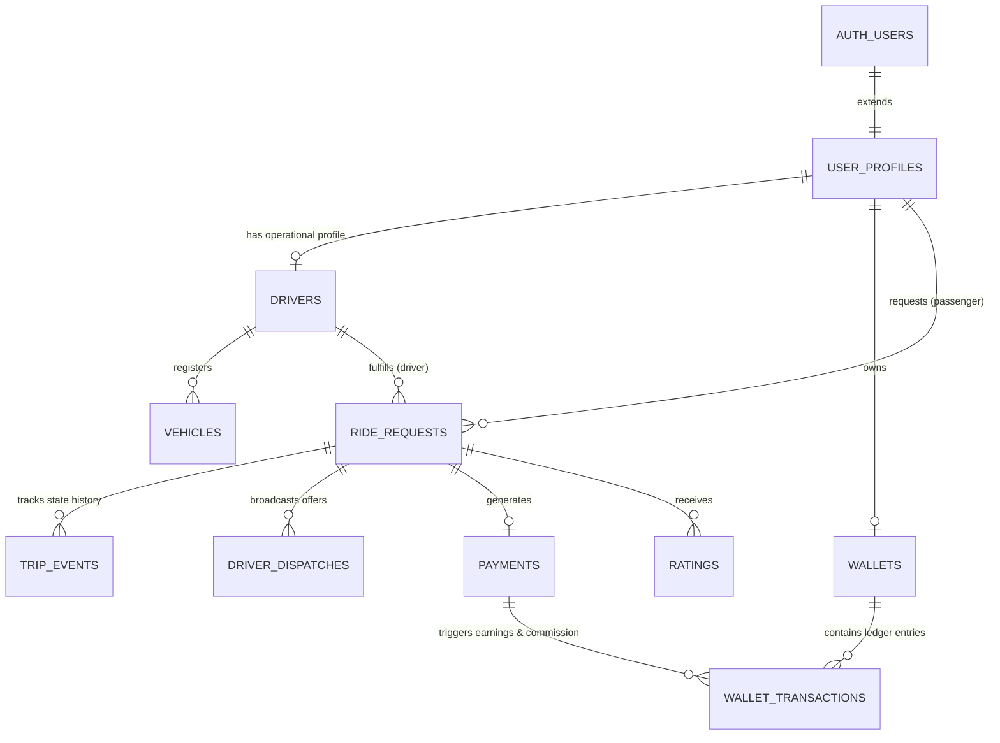

# Cruz — Database Relationships & ERD

## Entity Relationships

## Referential Integrity Rules
- Deletion of a user is soft (`is_active = false`) to maintain historical trip and financial ledger records.
- Deletion of trips is strictly prohibited. State transitions must move to `CANCELLED` with explicit reason.
- `wallet_transactions` are append-only. Adjustments or reversals are represented as new compensating transaction records.
