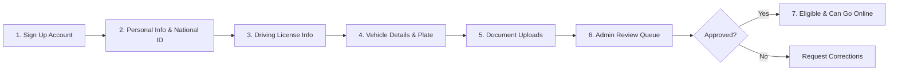

# Cruz — Driver Onboarding Workflow

## 1. Onboarding Pipeline

## 2. Onboarding Requirements for MVP Pilot
- **Personal Details**: Full legal name, verified mobile phone number, email address.
- **Identification**: Kenyan National Identity Card (ID) number.
- **Driving Credentials**: Valid Kenyan Driving License number (minimum 2 years driving experience).
- **Vehicle Information**: Make, Model, Year of Manufacture (minimum 2013 for standard category), Color, License Plate Number.
- **Verification Documents**: Driver's license copy, vehicle registration/logbook copy, valid motor vehicle insurance certificate.
