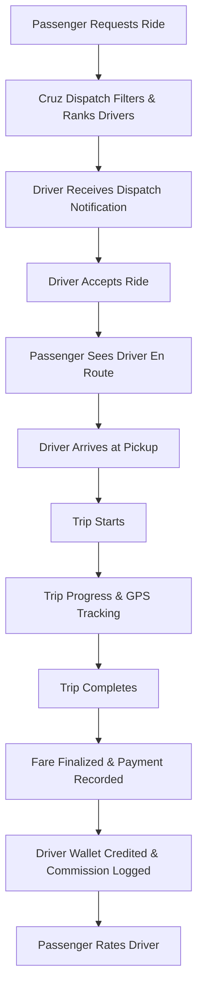

# Cruz — MVP Specification & Scope

## 1. MVP Objective
The primary milestone for the MVP is to prove the core ride-hailing loop end-to-end with high reliability, zero simulated bugs, and zero cloud costs.

## 2. Included MVP Feature Sets

### 2.1 Passenger Experience
- User Registration & Authentication (Email/Password + Session Management)
- Profile management
- Pickup location & destination selection (with mock/geo coordinates in Nairobi)
- Realtime fare estimation based on base fare, distance, and duration
- Ride request dispatching
- Live driver tracking & ETA display
- Trip status progression (Arriving, Pickup, In-Trip, Completed)
- Payment confirmation (Mock Payment Provider / M-Pesa ready)
- Driver rating (1–5 stars) and feedback
- Ride history & receipts

### 2.2 Driver Experience
- Driver Registration & Authentication
- Driver onboarding profile (License number, National ID)
- Vehicle registration (Make, Model, Year, Plate Number, Color)
- Document upload placeholder/storage (Driver's License, Vehicle Insurance)
- Driver status toggle (Online / Offline / Available)
- Incoming ride request modal with countdown timer, pickup address, distance, and fare estimate
- Accept / Decline actions
- Navigation & trip stage controls:
  - "Arrived at Pickup"
  - "Start Trip"
  - "Complete Trip"
- Earnings summary dashboard (Daily gross, Net earnings, Platform fees)
- Trip history

### 2.3 Operations & Admin Experience
- Secure Operations Authentication
- Realtime Operations Dashboard:
  - Active Drivers & Status (Online / In-Trip / Offline)
  - Active Rides & Trip State monitoring
  - Total Daily Gross Volume (KES) and Platform Commission
- Driver Application Review & Approval / Rejection
- Passenger management & account suspension controls
- Trip audit logs & event history
- Financial ledger review & transaction inspection

## 3. Explicitly Deferred Non-MVP Features
- Surge pricing algorithms
- Ride scheduling / pre-booking
- In-app voice/VoIP calling
- Corporate billing accounts
- Boda-boda & food/parcel delivery modes
- Cryptocurrency / complex split payments
- Driver micro-loans & financing
